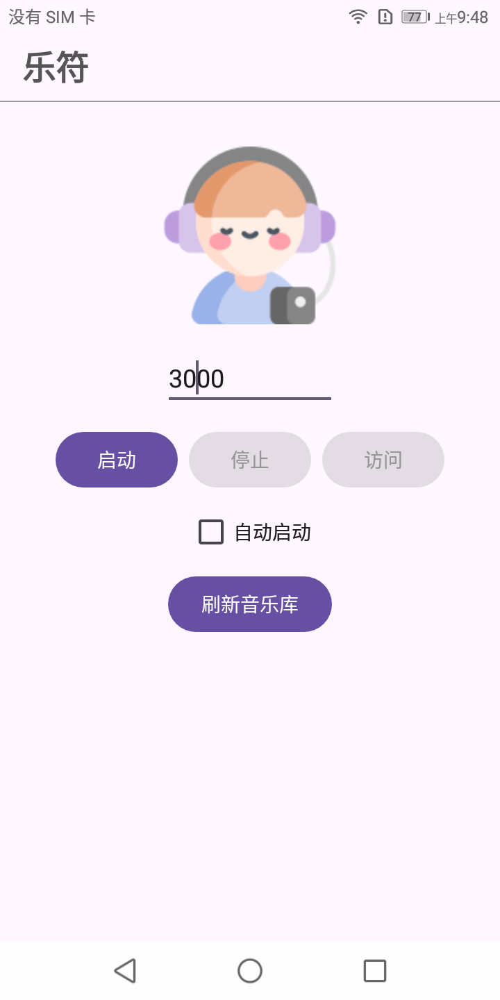

# YueServ(乐符)
在安卓上使用网页版音乐播放器。播放器来自 [SimpleMusicPlayer](https://github.com/jjling2011/SimpleMusicPlayer) 项目。  

  

### 安装
 * 从 [releases](https://github.com/jjling2011/YueServ/releases/latest/) 下载 APK 包安装

设置好端口点启动，然后点“访问”调出浏览器。目前只有 edge 浏览器支持线控功能。  
如果手机里新增的歌曲没出现在音乐库中，请点下“刷新音乐库”。  

  

### 更新日志
[update.md](./docs/update.md)  
